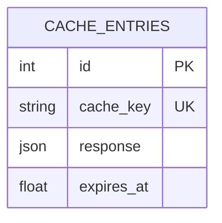
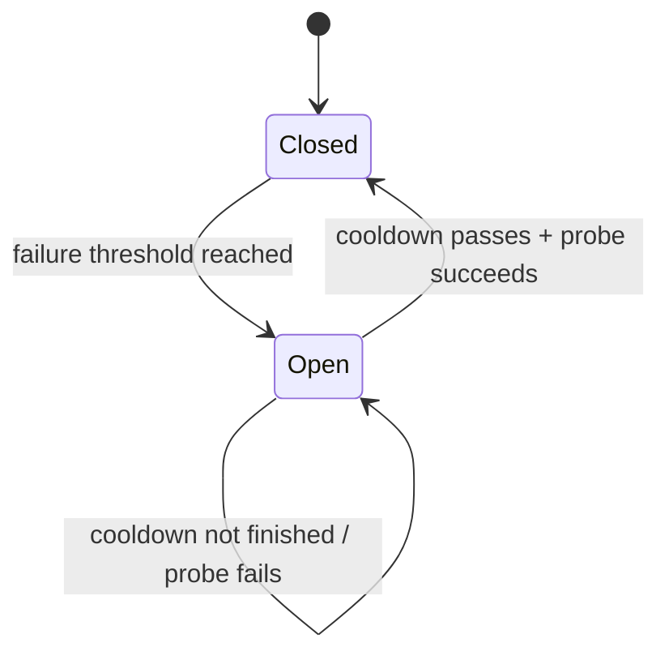

# How Better Call Saul Works

This is the internals. Saul handles the client, Gus decides who gets the job, Mike keeps unreliable providers out, and Ice Station Zebra remembers what already happened.

## Stack

| Layer | Choice | Why |
|---|---|---|
| Web | **FastAPI** | Async, Pydantic validation, `/docs` included |
| Validation | **Pydantic v2** | Typed request/response models and cross-field rules |
| Config | **pydantic-settings** | Typed env vars and `.env` config |
| Database | **SQLite + SQLAlchemy 2 async** | Zero setup, persistent cache |
| SQLite driver | **aiosqlite** | Async DB access |
| HTTP | **httpx** | Async upstream requests |
| Server | **uvicorn** | Runs FastAPI |
| Tests | **pytest + pytest-asyncio** | Async tests without real providers |
| Linting | **ruff** | Formatting and linting |
| Packaging | **Docker** | Reproducible single-container setup |

HTTP and database I/O are async, so waiting for NASA or SQLite does not block the whole server.

## Files

```text
app/
  main.py             FastAPI app + routes
  config.py           settings
  database.py         async SQLAlchemy setup
  models.py           cache table
  schemas.py          API models
  http.py             shared httpx client
  cache.py            Ice Station Zebra
  router.py           Gus: provider ranking
  circuit_breaker.py  Mike: provider health
  stats.py            provider metrics
  optimizer.py        Saul's actual operation

  providers/
    base.py            WeatherProvider + WeatherReport
    openweather.py     OpenWeather adapter
    nasa_power.py      NASA POWER adapter
```

Dependencies only go downward:

```text
main
  ↓
optimizer
  ↓
cache / router / providers / circuit_breaker / stats
```

Nothing imports back up the chain, so adding a new provider should not require disturbing everything else.

## What `/weather` does

FastAPI first validates the request. Latitude must be between `-90` and `90`, the strategy must be valid, and the request needs either `city` or both `lat` and `lon`. Invalid input gets `422` before Saul starts making phone calls.

The optimizer then builds a cache key such as:

```text
weather:budapest
weather:47.49:19.04
```

Ice Station Zebra checks SQLite for a fresh result. If one exists, it comes straight back with `cached: true`. Otherwise Gus ranks the configured providers:

```text
cheap     → lowest cost
fast      → lowest average latency
reliable  → highest success rate
```

Before enough real measurements exist, ranking uses each provider's static latency and reliability estimates. Once actual requests come in, those estimates get replaced by observed performance.

Saul then walks the list. Mike skips providers whose circuit is open. A successful `fetch()` records latency, caches the normalized result, and returns it. A `ValueError`, such as NASA being unable to handle a city lookup, simply moves the job to the next provider. Timeouts and HTTP failures count against both the provider stats and its circuit breaker.

If nobody can do the job, Saul translates the result into something useful:

| Status | Meaning |
|---|---|
| `422` | Request shape cannot be served |
| `502` | Providers were reached but failed |
| `503` | No usable provider is currently available |

No half measures, but also no mysterious `500` for everything.

## Cache

There is one table:



`response` stores the normalized weather payload. `expires_at` is a Unix timestamp, which keeps SQLite timezone handling out of the operation entirely.

The default TTL is `CACHE_TTL_SECONDS`, currently 600 seconds, unless the request overrides it with `freshness_seconds`.

## How Gus "learns"

`stats.py` keeps successes, failures, total latency, and total cost for each provider. From those it derives:

```text
success_rate = successes / (successes + failures)

avg_latency_ms = total_latency_ms / successes
```

Gus uses those values when ranking providers. So `fast` initially means "we think this one is fast," but after enough requests it means "this one has actually been faster."

There is no ML here. Gus just keeps good books. `/metrics` exposes the numbers.

## Mike's circuit breaker



After enough consecutive failures, Mike opens the circuit and stops sending work to that provider. Once `CIRCUIT_RECOVERY_SECONDS` passes, one request is allowed through as a probe. Success closes the circuit; failure sends it straight back to open.

The breaker lives in process memory. In the intended single-worker setup there is no cross-thread coordination layer. If you run multiple workers, each worker gets its own Mike.

## Testing

Tests use a temporary SQLite database and fake providers, so they need neither API keys nor network access.

```text
tests/test_weather.py
    gateway behaviour
    caching
    fallback
    circuit breaker

tests/test_providers.py
    provider response parsing
    NASA POWER edge cases
    -999 fill values
```

That keeps provider failures deterministic instead of hoping Albuquerque's internet behaves during CI.

## Docker

The container installs the dependencies, copies the app, and stores SQLite under `/data` so the database can live on a mounted volume:

```text
/data
  └── cache database
```

The application only needs outbound access to the configured weather providers. No analytics service, telemetry backend, or Madrigal Electromotive subsidiary is hiding behind it.

Provider adapters validate upstream JSON and translate malformed responses into
provider failures before they reach the API boundary. Cache payloads and
metrics use explicit typed shapes; circuit-breaker and statistics state remain
lightweight in-process dataclasses.

## Deliberately missing

There is **no authentication** because this is a gateway demo, not a user platform. There is **no ML** because real latency and reliability measurements already solve the routing problem well enough. There is **no shared multi-process state**, so provider stats and circuit breakers belong to each worker independently. There are also **no migrations** because the database currently consists of one table created on startup. Bringing in Alembic for that would be the architectural equivalent of constructing a superlab to make instant coffee.