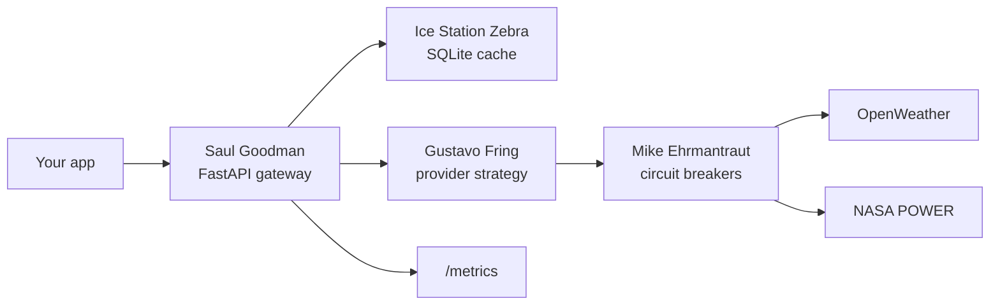
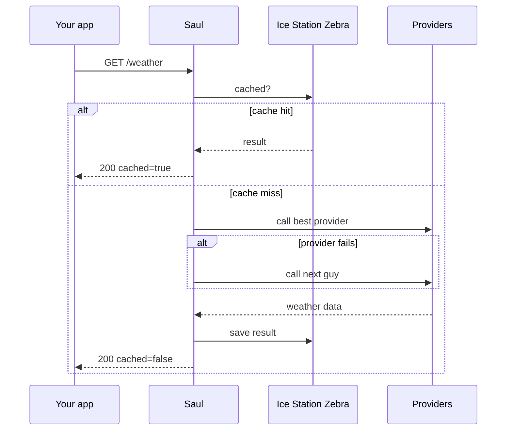
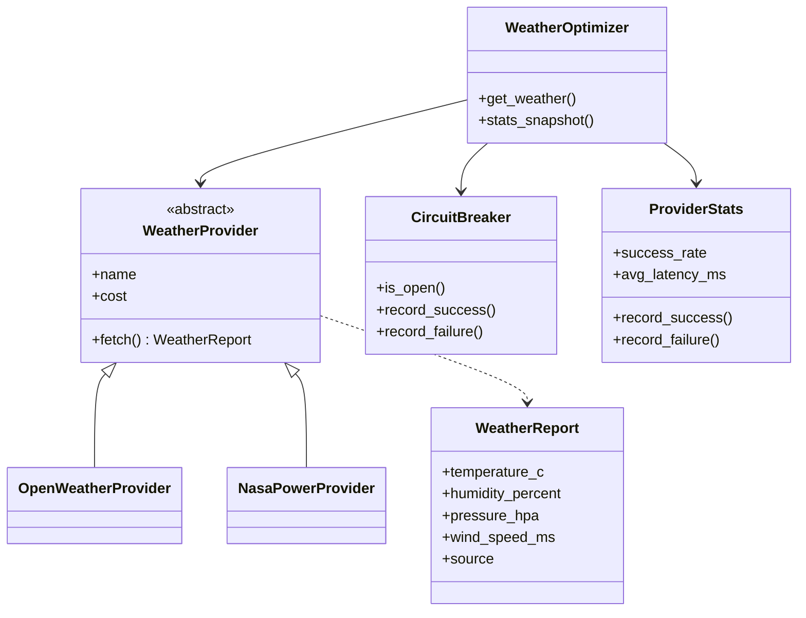

# Better Call Saul

Your app wants the weather in Budapest. It does not care that OpenWeather returns:

```json
{"main": {"temp": 26}}
```

while NASA POWER returns:

```json
{"properties": {"parameter": {"T2M": {"20260821": 26.4}}}}
```

It just wants one clean response. Better Call Saul handles the mess in between: it calls providers, normalizes their responses, caches results, tracks reliability and latency, and falls back to another provider when one stops answering.

## What it solves

Three things matter here: avoid duplicate upstream calls, survive provider failures, and choose providers using actual measurements instead of hardcoded assumptions. If ten clients request the same weather data, one cached result should be enough. If one provider dies, the gateway should quietly call somebody else. If one provider is consistently faster or more reliable, the router should learn that from real requests.

## Architecture



The client only deals with Saul. Gus ranks the providers, Mike keeps unreliable ones out, and Ice Station Zebra stores recent results. Every provider sits behind the same `WeatherProvider` interface and returns the same `WeatherReport` model.

## Request flow



In practice: check the cache, rank providers, call the best one, fall back if needed, normalize the result, cache it, return it.

## Design



- **Saul - facade.** The client calls `/weather` and does not need to know anything about provider schemas, failures, retries, or caching.
- **Gus - strategy.** Providers can be ranked by `cheap`, `fast`, or `reliable`. The ordering comes from actual performance data.
- **Mike - circuit breaker.** If a provider keeps failing, Mike temporarily stops sending requests to it. No half measures.
- **Fallback.** If the first provider fails, Saul calls another guy. If everybody disappears, then we start asking about a Hoover MaxExtract PressurePro model 60.
- **Adapters.** Every provider converts its own response into the same `WeatherReport`, so the rest of the code does not care where the data came from.
- **Ice Station Zebra - cache.** Recent responses are stored in SQLite, so repeated requests do not automatically mean repeated API calls. For tax purposes, obviously.

## Running it

NASA POWER works without an API key:

```bash
docker build -t better-call-saul .

docker run --rm \
  -p 8000:8000 \
  -v ice_station_zebra:/data \
  better-call-saul
```

Example:

```bash
curl "http://localhost:8000/weather?lat=47.49&lon=19.04"
```

```json
{
  "temperature_c": 28.17,
  "humidity_percent": 50.99,
  "pressure_hpa": 989.2,
  "wind_speed_ms": 3.21,
  "source": "nasa_power",
  "cached": false
}
```

For OpenWeather:

```bash
docker run --rm \
  -p 8000:8000 \
  -v ice_station_zebra:/data \
  -e OPENWEATHER_API_KEY=your-key \
  better-call-saul
```

Without Docker:

```bash
pip install -e ".[dev]"
uvicorn app.main:app --reload
```

## API

| Method | Path | Purpose |
|---|---|---|
| `GET` | `/weather` | Get weather data |
| `GET` | `/metrics` | Provider performance stats |
| `GET` | `/health` | Check whether Saul is still practicing law |

`/weather` supports `city`, `lat`, `lon`, `strategy=cheap|fast|reliable`, and `freshness_seconds`. FastAPI docs are available at `/docs`.

## Does it learn?

Not in the ML sense. The gateway records success rate, latency, and failures, then uses those measurements to rank providers. If one gets worse, Mike notices. If another becomes faster, Gus moves it up. No neural networks, no `"AI-powered"` sticker, just measurements.

## Providers

Currently: OpenWeather and NASA POWER. Adding another provider just means implementing `WeatherProvider`. Saul, Gus, and Mike stay untouched.

See [`ARCHITECTURE.md`](ARCHITECTURE.md) for the detailed system design.

## License

[MIT](LICENSE)

*Not affiliated with Saul Goodman & Associates, Madrigal Electromotive GmbH, Los Pollos Hermanos, or Ice Station Zebra Associates. Go Land Crabs.*