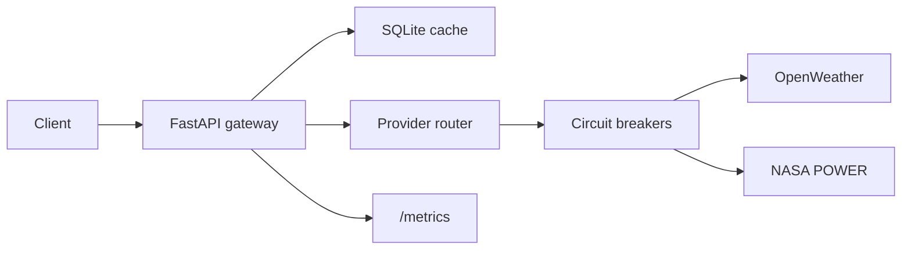
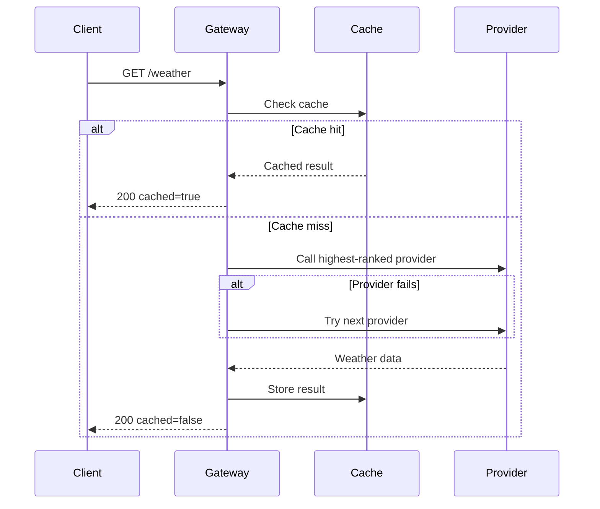
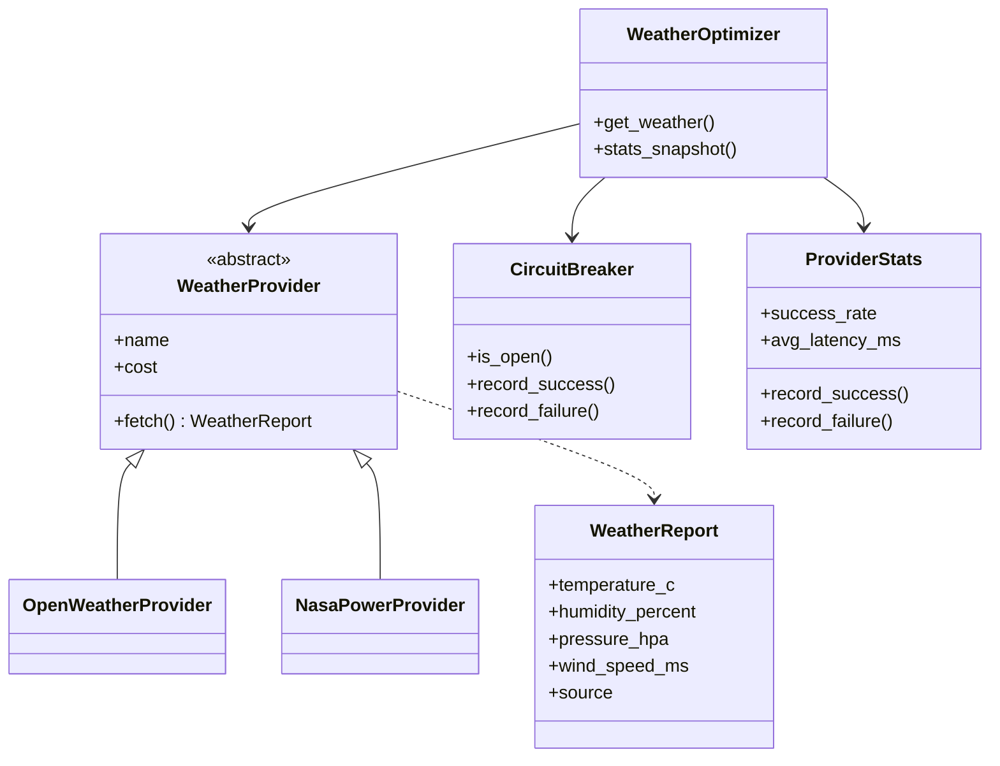

# Better Call Saul

A small weather API gateway that hides provider-specific formats behind one consistent interface.

OpenWeather might return:

```json
{"main": {"temp": 26}}
```

while NASA POWER returns something closer to:

```json
{"properties": {"parameter": {"T2M": {"20260821": 26.4}}}}
```

Better Call Saul handles that difference for the client. It queries weather providers, normalizes their responses, caches results, tracks provider performance, and falls back when a provider is unavailable.

## What it does

The gateway focuses on three things:

- avoiding unnecessary upstream requests through caching
- handling provider failures without breaking the client request
- ranking providers using observed latency and reliability

If several clients request the same recent weather data, the cached result can be reused. If one provider fails, the gateway tries another. Over time, provider statistics are used to make better routing decisions.

## Architecture



The client only communicates with the gateway.

Each provider implements the same `WeatherProvider` interface and converts its upstream response into a common `WeatherReport` model. Provider selection, caching, failure handling, and metrics remain internal to the application.

## Request flow



In short:

1. check the cache
2. rank available providers
3. query the highest-ranked provider
4. fall back if necessary
5. normalize the response
6. cache it
7. return it

## Design



### Provider adapters

Each weather service has its own response format. Provider adapters translate those responses into the shared `WeatherReport` model, so the rest of the application does not depend on provider-specific schemas.

### Provider routing

Providers can be ranked using three strategies:

- `cheap`
- `fast`
- `reliable`

Static provider characteristics are used initially. As requests are processed, observed latency and success rates are used instead.

### Circuit breakers

Each provider has a circuit breaker. Repeated failures temporarily remove a provider from consideration, preventing the gateway from repeatedly calling an upstream service that is already failing.

Mike would approve.

### Fallback

If the preferred provider fails, the gateway tries the next available provider.

The client does not need to implement its own provider fallback logic.

### Cache

Recent weather responses are stored in SQLite. The `freshness_seconds` parameter controls how long a cached result can be reused.

## Running it

NASA POWER does not require an API key.

```bash
docker build -t better-call-saul .

docker run --rm \
  -p 8000:8000 \
  -v ice_station_zebra:/data \
  better-call-saul
```

Example request:

```bash
curl "http://localhost:8000/weather?lat=47.49&lon=19.04"
```

Example response:

```json
{
  "temperature_c": 28.17,
  "humidity_percent": 50.99,
  "pressure_hpa": 989.2,
  "wind_speed_ms": 3.21,
  "source": "nasa_power",
  "cached": false
}
```

To enable OpenWeather:

```bash
docker run --rm \
  -p 8000:8000 \
  -v ice_station_zebra:/data \
  -e OPENWEATHER_API_KEY=your-key \
  better-call-saul
```

Without Docker:

```bash
pip install -e ".[dev]"
uvicorn app.main:app --reload
```

## API

| Method | Path | Purpose |
| --- | --- | --- |
| `GET` | `/weather` | Retrieve weather data |
| `GET` | `/metrics` | View provider performance statistics |
| `GET` | `/health` | Health check |

`/weather` accepts:

- `city`
- `lat`
- `lon`
- `strategy=cheap|fast|reliable`
- `freshness_seconds`

Interactive FastAPI documentation is available at `/docs`.

## Does it learn?

Only in a limited sense.

The gateway records provider latency, successes, and failures and uses those measurements when ranking providers. There is no machine learning involved.

A provider that becomes slower or less reliable will gradually rank lower. A provider that performs better can move up.

## Providers

Currently supported:

- OpenWeather
- NASA POWER

Adding another provider requires implementing the `WeatherProvider` interface and converting its response into `WeatherReport`.

See [ARCHITECTURE.md](ARCHITECTURE.md) for more detail.

## License

[MIT](LICENSE)
